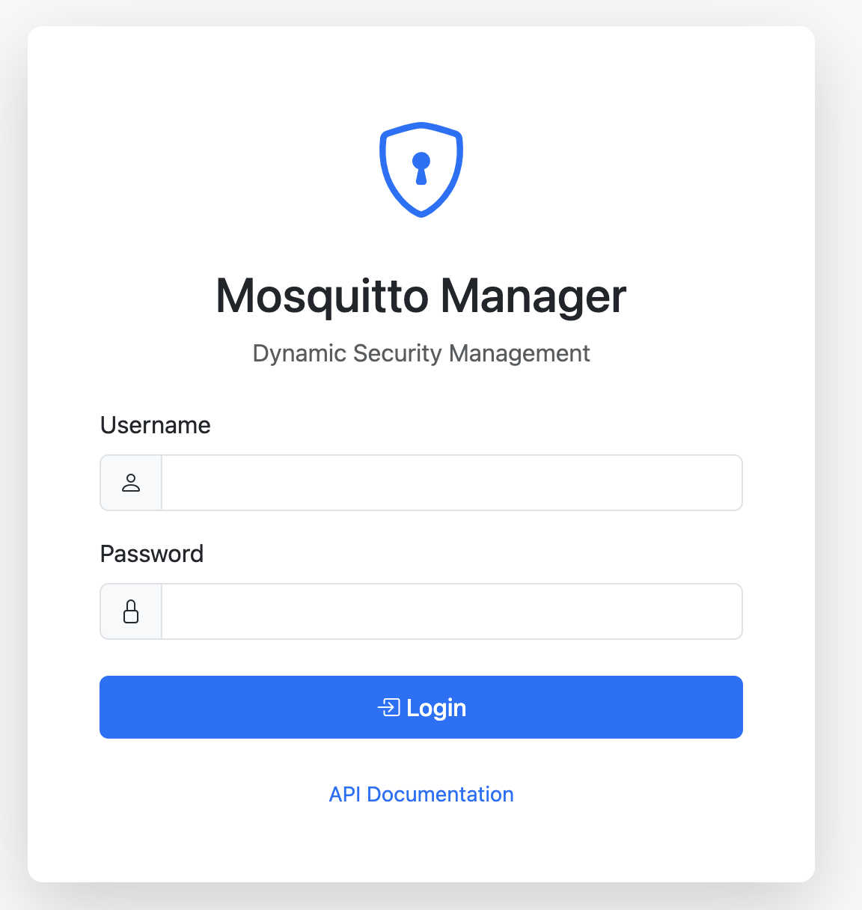
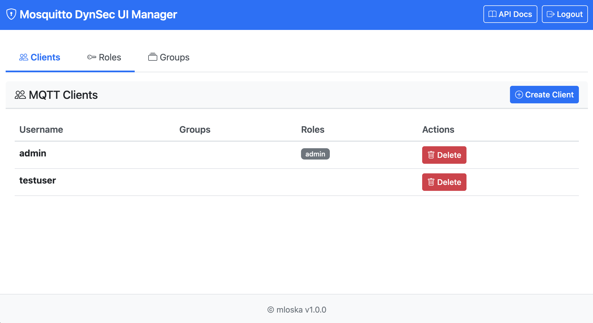

# Mosquitto Dynamic Security Manager

A small REST API and a simple web UI for managing users, roles and ACLs for an Eclipse Mosquitto broker (using the dynamic security plugin).

This repo provides a lightweight API plus a minimal web interface so you can manage MQTT credentials and permissions without a separate database — everything is stored in Mosquitto's dynamic-security.json.

**Warning:** This project is under active development and not production-ready. Use with caution and do not expose default credentials or the management UI to the public internet.

## Quick overview

- Manage clients: create, change password, enable/disable, delete.
- Roles: define permissions (publish/subscribe and patterns) and attach them to clients or groups.
- Groups: group clients and assign roles to the whole group.
- Works with one or more Mosquitto instances — you can pass host/port per request or set defaults.

### Screenshots





## Why this project

If you run devices or sensors that need programmatic provisioning, this project gives you a simple HTTP API to do that. It's intentionally minimal: no extra database, familiar CLI tools under the hood, and automatic API docs from FastAPI.

## Quick start (Docker)

1. Clone the repo and change into it:

```bash
git clone https://github.com/yourusername/mosquitto-manager.git
cd mosquitto-manager
```

2. Copy the example env file and edit credentials if you want:

```bash
cp env/.env.example .env
# edit .env to your liking
```

3. Start the services:

```bash
docker-compose up -d
```

Then open the API docs at http://localhost:8000/docs

## Defaults (change in `.env` for production):

- API username/password: `admin` / `admin`
- Mosquitto host: `mosquitto`
- Mosquitto port: `1883`

## If you prefer to run locally without Docker

```bash
pip install -r requirements.txt
export API_USERNAME=admin
export API_PASSWORD=admin
export MOSQUITTO_HOST=localhost
export MOSQUITTO_PORT=1883
python -m uvicorn app.main:app --reload --port 8000
```

Note: the `mosquitto_ctrl` wrapper expects the mosquitto clients utilities to be available (install via brew, apt, etc.).

## Common commands

- List clients

```bash
curl -u admin:admin http://localhost:8000/api/clients
```

- Create a client

```bash
curl -u admin:admin -X POST http://localhost:8000/api/clients \
  -H "Content-Type: application/json" \
  -d '{"username":"sensor01","password":"SecurePass123","textname":"Temperature Sensor"}'
```

- Create a role and add an ACL

```bash
curl -u admin:admin -X POST http://localhost:8000/api/roles \
  -H "Content-Type: application/json" \
  -d '{"role_name":"sensors","textname":"Sensor Devices"}'

curl -u admin:admin -X POST http://localhost:8000/api/roles/sensors/acls \
  -H "Content-Type: application/json" \
  -d '{"acl_type":"publishClientSend","topic":"sensors/#","allow":true,"priority":1}'
```

- Assign the role to a client

```bash
curl -u admin:admin -X POST http://localhost:8000/api/clients/sensor01/roles \
  -H "Content-Type: application/json" \
  -d '{"role_name":"sensors","priority":1}'
```

## Notes and tips

- Use strong passwords and do not leave the default `admin/admin` in production.
- Consider putting the API behind TLS (nginx/Traefik) when exposing it to the internet.
- The dynamic security JSON is the single source of truth; back it up regularly.
- Priority numbers: lower means higher priority. `-1` is effectively admin.

## Useful troubleshooting

- If the API returns an error when talking to Mosquitto, ensure the `mosquitto_ctrl` binary is available and that the broker is reachable from the API container.
- To inspect Mosquitto's dynamic security file, check `mosquitto/config/dynamic-security.json` in this repo's `mosquitto` folder.

## Project structure

```
app/                 # FastAPI app and helpers
mosquitto/           # sample mosquitto config and dynamic-security.json
Dockerfile, docker-compose.yml
requirements.txt
README_human.md      # This file — a simple, human-friendly README
```

## License

This project uses the MIT license (see `LICENSE`).

## Want changes?

If you'd like a shorter quickstart, more examples, or the README tailored to a particular deployment (kubernetes/traefik/letsencrypt), tell me which one and I'll update it.